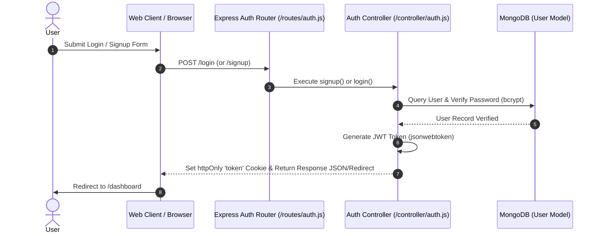
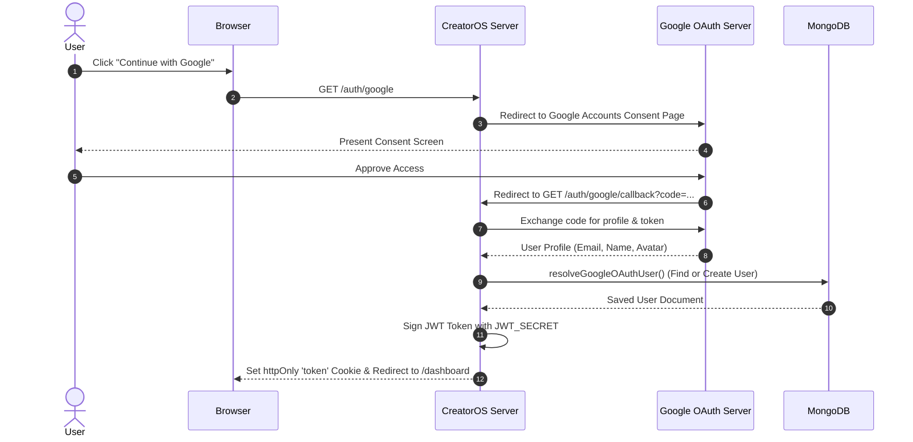

# CreatorOS Authentication Architecture (`docs/AUTH.md`)

This document details the authentication architecture, security configuration, session management, and authorization rules for CreatorOS.

---

## 1. Architecture Overview

CreatorOS implements a stateless **JSON Web Token (JWT)** authentication mechanism as its primary identity system, coupled with an optional **Google OAuth 2.0** Single Sign-On (SSO) flow via Passport.js.

```
┌─────────────────────────────────────────────────────────────────────────────┐
│                           CreatorOS Auth Layer                              │
├──────────────────────────────────────┬──────────────────────────────────────┤
│ Primary Authentication               │ Optional SSO Integration             │
│ Custom JWT (jsonwebtoken)            │ Google OAuth 2.0 (passport-google)   │
│ Email + Hashed Password (bcryptjs)   │ Federated OAuth User Provisioning    │
└──────────────────────────────────────┴──────────────────────────────────────┘
```

> [!NOTE]
> **Active Providers**: Custom JWT Authentication and Passport.js Google OAuth.  
> **Legacy / Non-existent Providers**: External auth providers such as Clerk are **not** present in the dependency tree or server pipeline.

---

## 2. Environment Variables

| Variable | Scope | Status | Purpose / Description |
| :--- | :--- | :--- | :--- |
| `JWT_SECRET` | Server | **Required** | Secret key used to sign and verify JWT tokens. |
| `SESSION_SECRET` | Server | **Required** | Secret key for Express session cookie signing and Passport session state. |
| `GOOGLE_CLIENT_ID` | Server | Optional | Google OAuth 2.0 Client ID for Google login button. |
| `GOOGLE_CLIENT_SECRET` | Server | Optional | Google OAuth 2.0 Client Secret for Google token exchange. |
| `GOOGLE_CALLBACK_URL` | Server | Optional | Authorized redirect URI (e.g. `http://localhost:3000/auth/google/callback`). |

---

## 3. Authentication Flows

### A. Local Email & Password Flow



### B. Google OAuth 2.0 Flow



---

## 4. Token Resolution & Middleware Security

Authentication checks are handled primarily by [`middleware/auth.js`](file:///d:/GSSoC/CreatorOs/CreatorOs/middleware/auth.js).

### Token Resolution Strategy
1. **Cookie Priority**: Reads `req.cookies.token` (httpOnly cookie).
2. **Header Fallback**: Reads `Authorization: Bearer <token>` from HTTP headers.

### Security Guards
- **Password Modification Check**: If `user.passwordChangedAt` timestamp is greater than token `iat` (issued-at), the token is invalidated and user is prompted to log in again.
- **Email Verification Enforcement**: In production mode (`NODE_ENV=production`), unverified standard users (non-Google) are redirected to `/resend-verification`.

---

## 5. Role-Based Access Control (RBAC)

CreatorOS supports four primary roles enforced by dedicated middleware functions in [`middleware/auth.js`](file:///d:/GSSoC/CreatorOs/CreatorOs/middleware/auth.js):

| Role | Description | Permissions & Restrictions |
| :--- | :--- | :--- |
| `admin` | System Administrator | Full read & write access across all endpoints; passes `requireAdmin`. |
| `user` | Standard Registered User | Full access to user dashboard, scheduling, and personal resources. |
| `contributor` | Open Source Contributor | Access restricted from write operations by `preventContributorWrites`. |
| `guest_contributor` | Temporary Session Contributor | Validated against `ContributorSession` collection; restricted write access. |

### Available Middleware Functions
- `protect`: Verifies JWT validity and attaches decoded payload to `req.user`.
- `requireAdmin`: Enforces `req.user.role === 'admin'`.
- `preventContributorWrites`: Returns 403 for `contributor` / `guest_contributor` roles when this middleware is mounted (typically on mutation routes). It does not itself filter by HTTP method.
- `redirectIfAuthenticated`: Utility middleware for landing/login pages to redirect active sessions to `/dashboard`.
